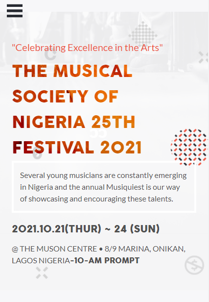
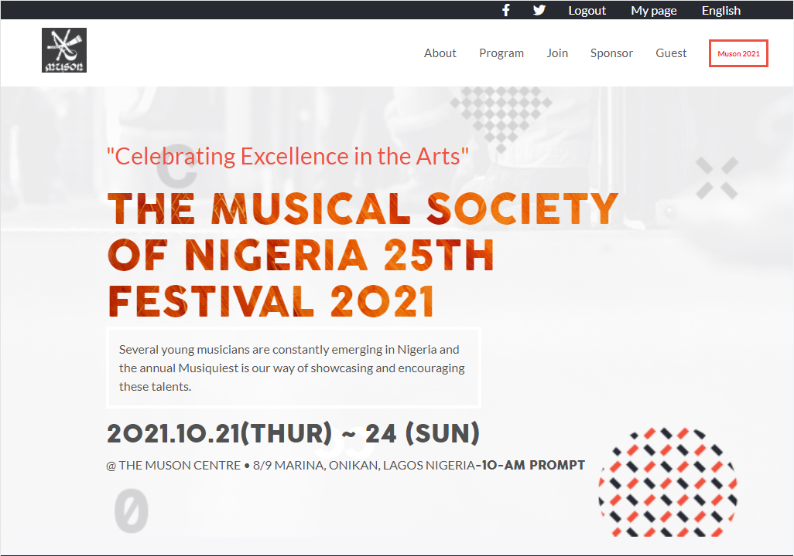

# html-css-js-capstone-project

This is my final project for HTML & CSS MODULE ONE from the microverse curriculum.

  

  

This project is meant to test student ability's on being able to put together all that they have learnt in a module to ensure they mastered it well.

## Built With

- HTML
- CSS
- JAVASCRIPT

Here's a [video ]  of the project description.

## Live Demo

[Live Demo Link](https://chukwuemeka1234.github.io/Capstone-music-concert/)

## Getting Started

To get a local copy up and running:

1. Clone this repository or download the Zip folder:

**``git clone https://github.com/chukwuemeka1234/Capstone-music-concert.git``**

2. Navigate to the location of the folder in your machine:

**``you@your-Pc-name:~$ cd <folder>``**

## Authors

👤 **Author**

- GitHub: [@chukwuemeka1234](https://github.com/chukwuemeka1234)
- Twitter: [@avc_victor](https://twitter.com/@avc_victor)
- LinkedIn: [ani-chukwuemeka](https://linkedin.com/in/ani-chukwuemeka-a65421199/)

## Credits

- The original design ideal by [Cindy Shin in Behance](https://www.behance.net/adagio07)

- Project from [Microverse](https://bit.ly/MicroverseTN) html & css module
- Images inspired by this [All avatar images](https://pravatar.cc/images) & [Google search](https://google.com)

## 🤝 Contributing

Contributions, issues, and feature requests are welcome!

## Show your support

Give a ⭐️ if you like this project!

## 📝 License

This project is [MIT](./MIT.md) licensed.
